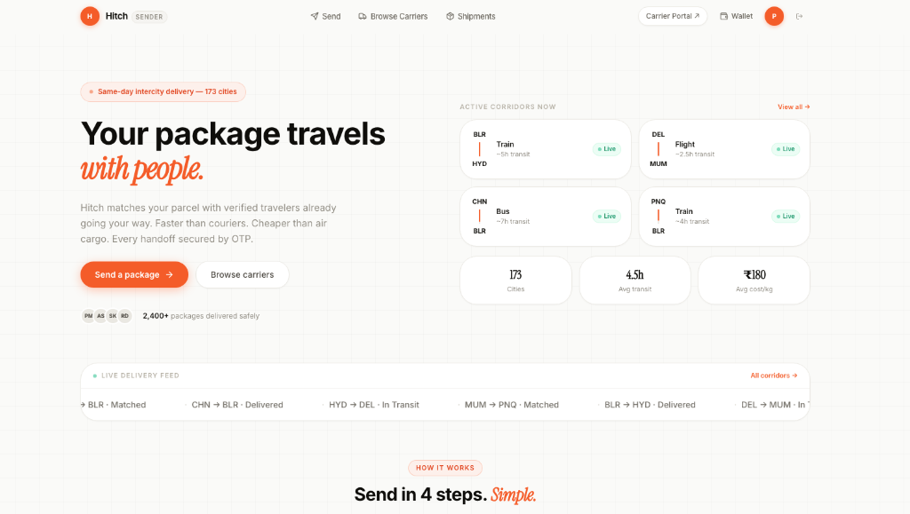
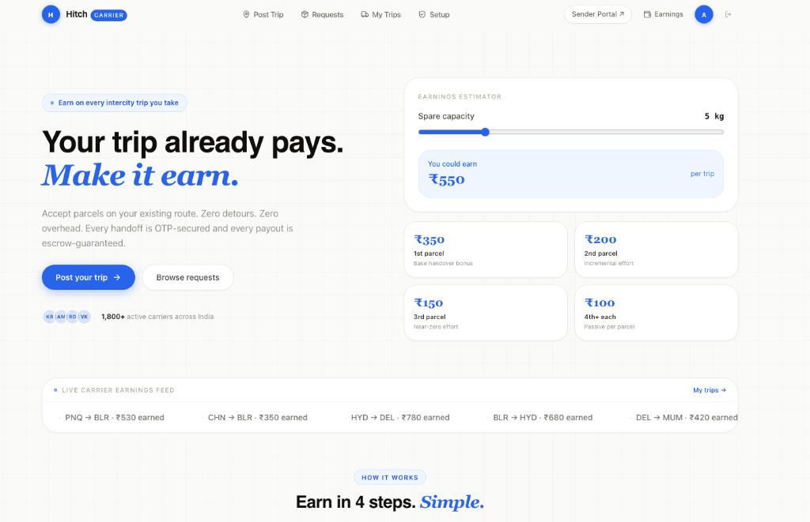
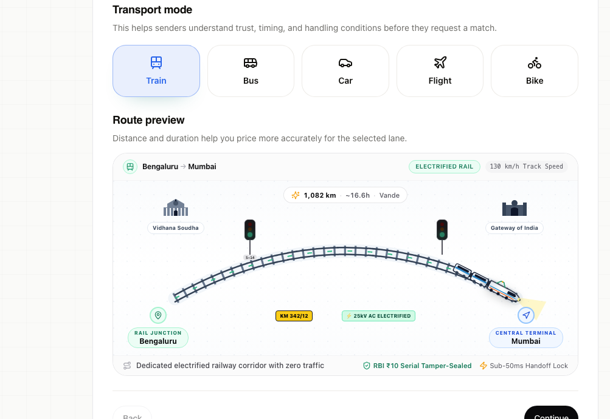

# Hitch (HopDrop)

> **Peer-to-peer intercity logistics engine connecting senders with verified travelers heading on existing routes across 170+ Indian cities.**  
> Same-day delivery powered by spare luggage capacity in passenger vehicles, Vande Bharat rail corridors, and flights.

<div align="center">

| Sender Portal | Carrier Portal |
|:---:|:---:|
|  |  |
| **Instant Same-Day Dispatch**<br>Live corridor matching across 173 cities | **Traveler Monetization**<br>Interactive per-trip capacity earnings calculator |

</div>

<br>

<div align="center">
  
  <p><em>Interactive multimodal corridor radar: real-time transit telemetry, spatial route matching, dual-OTP custody handshake, and zero-hardware tamper-seal protocol.</em></p>
</div>

---

### Live Deployments

- 📦 **Sender Portal**: [hop-drop-sender-portal.vercel.app](https://hop-drop-sender-portal.vercel.app)
- 🚆 **Carrier Portal**: [hop-drop-carrier-portal.vercel.app](https://hop-drop-carrier-portal.vercel.app)

---

## Architecture Overview

```
hopdrop/
├── backend/              Express 5 TypeScript API (auth, matching, escrow, WebSockets)
├── sender-portal/        React 18 + Vite sender web app
├── carrier-portal/       React 18 + Vite traveler/carrier web app
├── admin-portal/         Internal telemetry and conversion dashboard
├── shared/               Shared UI primitives, geospatial utils, and TypeScript contracts
├── services/
│   ├── routing-search/   FastAPI geospatial corridor indexing & route scoring
│   ├── realtime-gateway/ Socket.IO cluster gateway with Redis adapter
│   ├── matching-orchestrator/ Background match scoring worker
│   ├── search-indexer/   Trip & corridor index sync worker
│   ├── notification-consumer/ Push notification event consumer
│   └── analytics-pipeline/   Telemetry aggregation pipeline
├── e2e/                  Playwright end-to-end test suite
├── infra/                Helm charts & Nginx ingress configurations
└── docker-compose.yml    Local multi-service orchestration
```

---

## Core Engineering Highlights

- **Spatial Corridor Matching**: Geospatial indexing matching delivery pickup/drop coordinates against active traveler transit corridors with time-window overlap and capacity constraints.
- **Concurrency & Double-Booking Guard**: Atomic distributed locking in Redis (`SET resource_key token NX PX 5000`) combined with MongoDB multi-document ACID transactions (`session.withTransaction`) to guarantee luggage capacity cannot be over-subscribed.
- **Dual-OTP Verification & Escrow**: Sender provides Pickup OTP; recipient provides Delivery OTP. Funds remain locked in multi-party platform escrow until physical handoff is cryptographically validated.
- **Tamper-Evident Physical Protocol**: Computer vision verification bound to RBI currency note serial numbers taped across package seams.
- **Horizontal Realtime Scaling**: Socket.IO room fanout backed by `@socket.io/redis-adapter` for multi-instance WebSocket synchronization.
- **Fault-Tolerant Payments**: Razorpay checkout integration protected by Opossum circuit breakers and idempotent webhook deduplication.

---

## Tech Stack

| Layer | Technologies |
|---|---|
| **Core API** | Node.js 20, Express 5, TypeScript, Mongoose 8, Zod |
| **Microservices** | Python 3.11, FastAPI, BullMQ, Redis 7, Kafka |
| **Frontends** | React 18, Vite 6, TypeScript, Tailwind CSS, Framer Motion |
| **Datastores** | MongoDB 7 (Replica Set), Redis 7 (Cache & Queue) |
| **Telemetry** | Prometheus, Grafana, OpenTelemetry, Pino JSON logging |
| **Verification** | Jest, Supertest, Playwright, Vitest |

---

## Local Development

### Prerequisites
- Node.js >= 20.0.0
- Docker Desktop
- Python >= 3.10 (for `services/routing-search`)

### 1. Environment Configuration
```bash
cp .env.example .env
```
Update necessary vendor credentials (`RAZORPAY_*`, `MMI_*`) if testing real provider handshakes. Default values are pre-wired for local containers.

### 2. Start Infrastructure
```bash
docker compose up -d --build --wait
```

### 3. Service Endpoints

| Service | Address |
|---|---|
| Sender Portal | `http://localhost:3001` |
| Carrier Portal | `http://localhost:3000` |
| Admin Analytics Portal | `http://localhost:3003` |
| Core API Gateway | `http://localhost:5001` |
| BullMQ Queue UI | `http://localhost/admin/queues` |
| Prometheus | `http://localhost:9090` |
| Grafana | `http://localhost:3003` |

### 4. Seed Development Data
```bash
npm run seed:docker
```

---

## Verification & Testing

```bash
# Run unit & integration tests across workspaces
npm test

# Run backend test suite with in-memory Mongo
npm run test:backend

# Run Playwright end-to-end user journeys
npm run test:e2e

# Run platform connectivity smoke test
npm run verify:platform
```

---

## Author

Supreet Patil ([@supreetpatil79](https://github.com/supreetpatil79))
