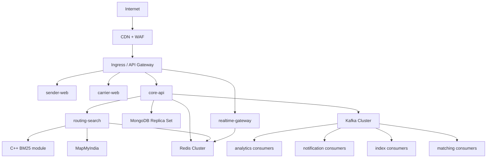
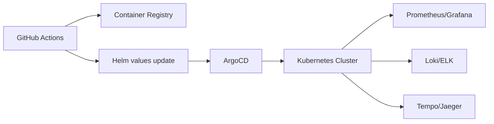

# HopDrop Kubernetes And Helm Topology

## Target Deployment Model



## Namespaces
- `hopdrop-apps`
- `hopdrop-data`
- `hopdrop-observability`
- `hopdrop-ingress`

Keep stateful services isolated from stateless application releases.

## Helm Layout
```text
infra/helm/
  hopdrop-platform/
    Chart.yaml
    values.yaml
    values-staging.yaml
    values-prod.yaml
    templates/
      sender-web-deployment.yaml
      carrier-web-deployment.yaml
      core-api-deployment.yaml
      routing-search-deployment.yaml
      realtime-gateway-deployment.yaml
      ingress.yaml
      configmap.yaml
      secrets-external.yaml
      hpa-core-api.yaml
      hpa-routing-search.yaml
      keda-matching-consumers.yaml
```

## Chart Strategy

### Option A: One umbrella chart
Good for early platform rollout when release coordination matters.

Use one umbrella chart while the platform is still moving quickly.

### Option B: One chart per service plus ArgoCD app-of-apps
Better after platform ownership is mature.

Recommendation:
- start with an umbrella chart for staging
- move to service charts for production once change volume rises

## Core Services

### `sender-web`
- type: stateless deployment
- replicas: 2 minimum
- scaling signal: CPU and request count
- ingress path: `/`

### `carrier-web`
- type: stateless deployment
- replicas: 2 minimum
- scaling signal: CPU and request count
- ingress path: `/carrier`

### `core-api`
- type: stateless deployment
- replicas: 3 minimum
- scaling signal:
  - CPU
  - memory
  - request latency
- readiness probe:
  - DB ping
  - Redis ping

### `routing-search`
- type: stateless deployment
- replicas: 2 minimum
- scaling signal:
  - CPU
  - latency
  - request rate
- separate node pool preferred if native BM25 becomes CPU heavy

### `realtime-gateway`
- type: stateless deployment
- replicas: 2 minimum
- scaling signal:
  - active websocket connections
  - network throughput

## Data Plane

### MongoDB
Use either:
- Atlas
- or StatefulSet with persistent volumes and anti-affinity

Recommendation:
- use managed MongoDB for production if possible

### Redis
Use:
- managed Redis cluster
- or Redis Sentinel / Redis Cluster if self-hosted

Separate logical databases or clusters for:
- hot cache
- locks and idempotency
- websocket adapter pub/sub

### Kafka
Use:
- managed Kafka if available
- otherwise Strimzi on Kubernetes

Create topics with retention and replay in mind:
- lifecycle events: longer retention
- location updates: shorter retention

## Ingress Design

### Public hostnames
- `app.hopdrop.com` -> sender web
- `carrier.hopdrop.com` or `/carrier` -> carrier web
- `api.hopdrop.com` -> core API
- `ws.hopdrop.com` -> realtime gateway

### TLS
- terminate at ingress
- enforce HTTPS
- use HSTS and secure cookie policies

## Autoscaling

### HPA
Use for:
- `sender-web`
- `carrier-web`
- `core-api`
- `routing-search`
- `realtime-gateway`

### KEDA
Use for:
- matching consumers
- notification consumers
- indexer consumers

Kafka lag should scale consumer groups, not API pods.

## Network Policies
Allow only:
- ingress -> apps
- apps -> data plane
- `core-api` -> `routing-search`
- apps -> `core-api` and `realtime-gateway`

Deny cross-service east-west traffic by default.

## Secret Management
Use External Secrets or sealed secrets for:
- Mongo connection strings
- Redis auth
- Kafka credentials
- JWT secrets
- Razorpay credentials
- MapMyIndia credentials
- Sentry DSN

Never bake secrets into Helm values committed to git.

## Observability Stack

### Metrics
- Prometheus
- Grafana

### Logs
- Fluent Bit
- Loki or Elasticsearch/OpenSearch

### Traces
- OpenTelemetry Collector
- Tempo or Jaeger

### Error tracking
- Sentry for frontend and backend

## Deployment Flow



## GitHub Actions Stages
1. lint
2. unit test
3. contract test
4. build app bundles
5. build Docker images
6. security scan
7. publish images
8. update Helm values
9. deploy to staging
10. smoke test
11. manual approval for prod
12. canary release

## Release Safety
For `core-api` and `routing-search`:
- rolling update with readiness gates
- canary 10% -> 25% -> 100%
- automatic rollback if:
  - 5xx spikes
  - p95 latency breach
  - consumer lag explodes

## Suggested Environment Split

### Staging
- smaller Kafka
- fewer partitions
- shared Redis if necessary
- lower replica floor

### Production
- dedicated Redis
- dedicated Kafka
- autoscaled consumers
- multi-AZ data services

## First Infrastructure Tickets
1. Create `infra/helm/hopdrop-platform` chart skeleton.
2. Add staging values for sender, carrier, core API, and routing-search.
3. Add OTEL collector and Prometheus stack to `hopdrop-observability`.
4. Add KEDA for matching consumers once Kafka is introduced.
